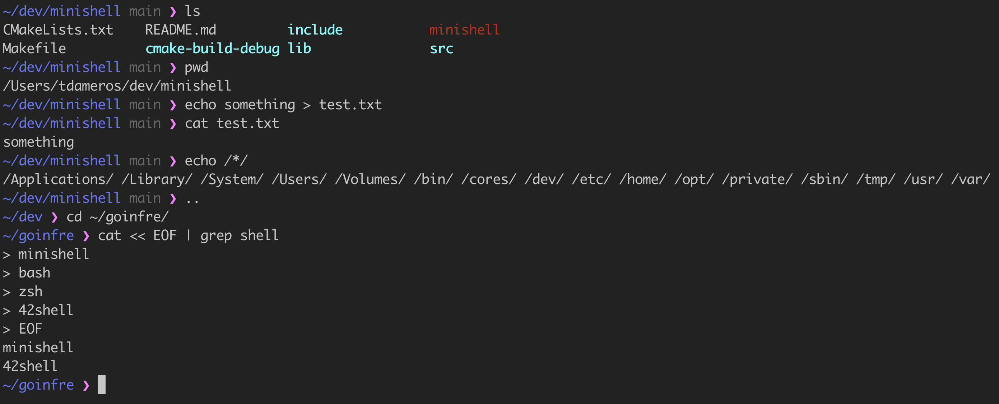

# Minishell Project

*As beautiful as a shell*

Minishell is a project from the 42 school curriculum that involves creating a basic shell similar to bash

This project was realized in 2 months by :

- Vincent Fries (_vfries_)
- Tom Damerose (_tdameros_)



# Get started

 ⚠️ Readline is required
```
git clone https://github.com/tdameros/42-minishell
cd 42-minishell/
make -j
./minishell
```

# Subject

The subject only allows the following functions as well as the **readline library**. Everything else must be recoded from scratch.


| External functions | readline, rl_clear_history, rl_on_new_line, rl_replace_line, rl_redisplay, add_history, printf, malloc, free, write, access, open, read, close, fork, wait, waitpid, wait3, wait4, signal, sigaction, sigemptyset, sigaddset, kill, exit, getcwd, chdir, stat, lstat, fstat, unlink, execve, dup, dup2, pipe, opendir, readdir, closedir, strerror, perror, isatty, ttyname, ttyslot, ioctl, getenv, tcsetattr, tcgetattr, tgetent, tgetflag, tgetnum, tgetstr, tgoto, tputs|
|--------------------| ------- |

Not use more than one global variable. Think about it. You will have to explain
its purpose.


# Functionalities

### Operators

| Operator                          | Example command                                       |
|-----------------------------------|-------------------------------------------------------|
| Input redirection: **<**          | grep 'shell' < Makefile                               |
| Output redirection: **>**         | cat Makefile > test.txt                               |
| Append output redirection: **>>** | cat Makefile >> test.txt                              |
| Here documents: **<<**            | cat << EOF                                            |
| Pipes: **&#124;**                 | ls &#124; grep 'c'                                    |
| And: **&&**                       | apt update && apt upgrade                             |
| Or: **&#124;&#124;**              | something &#124;&#124; echo Hello World               |
| Parenthesis: **(** & **)**        | (ls &#124;&#124; echo Hello World) && echo minishell  |
 
### Interactive Mode

Interactive Minishell interprets unclosed quotes and unfinished commands.

Minishell can be executed with the **-c option** to run a command without entering interactive mode.

| Shortcut | Feature                             |
|----------|-------------------------------------|
| *ctrl-C* | displays a new prompt on a new line |
| *ctrl-D* | exits the shell                     |
| ctrl-\   | does nothing                        |

### Builtins

| Builtin   | Implementation                        |
|-----------|---------------------------------------|
| *echo*    | with option -n                        |
| *cd*      | with only a relative or absolute path |
| *pwd*     | with no options                       |
| *export*  | with no options                       |
| *unset*   | with no options                       |
| *env*     | with no options or arguments          |
| *exit*    | with no options                       |
| *alias*   | with no options                       |
| *unalias* | with no options                       |

### Expansions

_Minishell alias implementation is not recursive and does not allow to interpret operators like bash._

1. Tildes (`~`, `~+`, `~-`)
2. Environment variables (`echo $PWD`)
3. Word splitting
4. Wildcards (only `*` in every directory: `echo /*/*`)
5. Quotes removal (`"l"'s'`)

### Minishellrc

At startup the `.minishellrc` file in the `HOME` path is executed.

Example :

```
alias g='git'
alias gcl='git clone'
alias gco='git checkout'
alias gl='git pull'
alias gb='git branch'
alias gp='git push'
alias gst='git status'

alias l='ls -lah --color=auto'
alias la='ls -lAh --color=auto'
alias ll='ls -lh --color=auto'
alias ls='ls -G --color=auto'
alias lsa='ls -lah --color=auto'

alias md='mkdir -p'
alias rd='rmdir'

alias ..='cd ..'
alias ../..='cd ../..'
alias ../../..='cd ../../..'
alias ../../../..='cd ../../../..'
```